# Исследование и Оптимизация Хэш-Таблиц

**Михаил Р.** _04.2023._

## Предыстроия

Этот небольшой проект был написан мной прежде всего в целях обучения.

Основная идея - оптимизация вставки в Хэш-таблицу, используя знания Assembly и SIMD-Инструкций. Для эффективного исследования также был использован профайлер **callgrind** + **kcachegrind**.

## Выбор хэш-функции

В отборе участвовали следущее функции:

~~~C++
size_t h_constant (char* Key);
~~~
Возвращает константый хэш
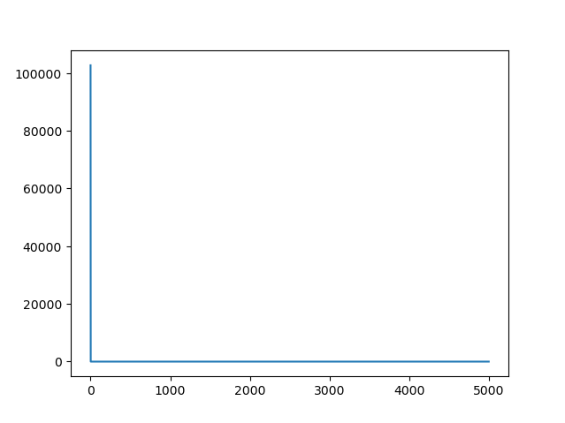


~~~C++
size_t h_first_ascii (char* Key);
~~~
Возвращает ASCII-код первого символа
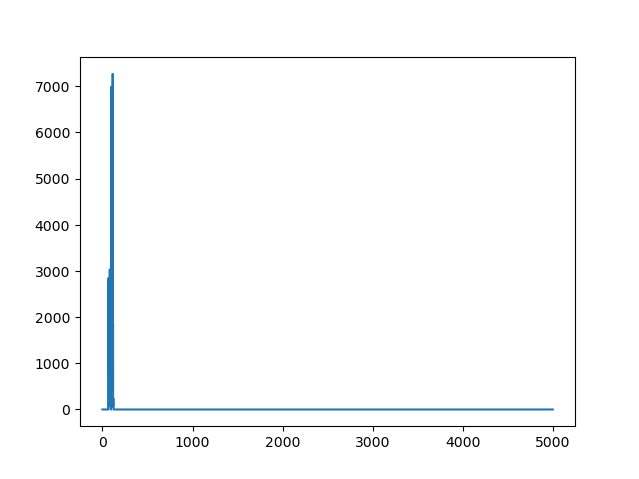

~~~C++
size_t h_length (char* Key);
~~~
Возвращает длину слова
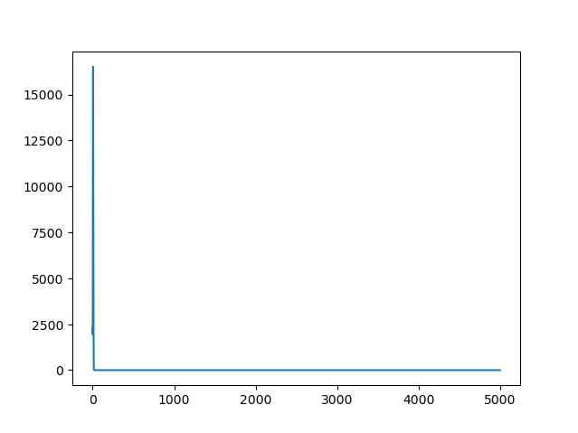

~~~C++
size_t h_sum_ascii (char* Key);
~~~
Возвращает сумму ASCII-кодов символов слова
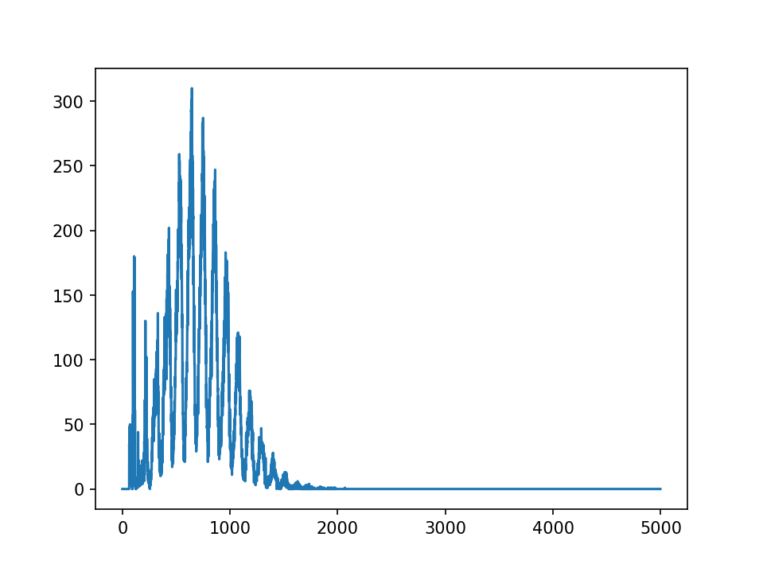

~~~C++
size_t h_rol (char* Key);
~~~
Возвращает рещультат рекурсивного алгоритма, осонованного на циклическом сдвиге влево
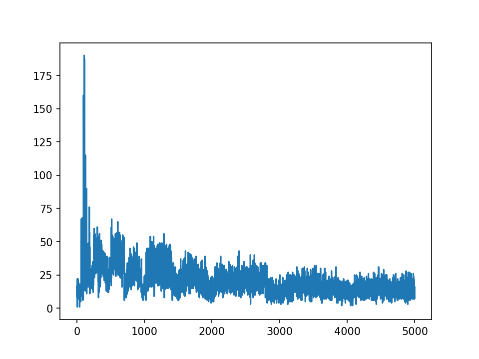

~~~C++
size_t h_ror (char* Key);
~~~
Возвращает рещультат рекурсивного алгоритма, осонованного на циклическом сдвиге вправо
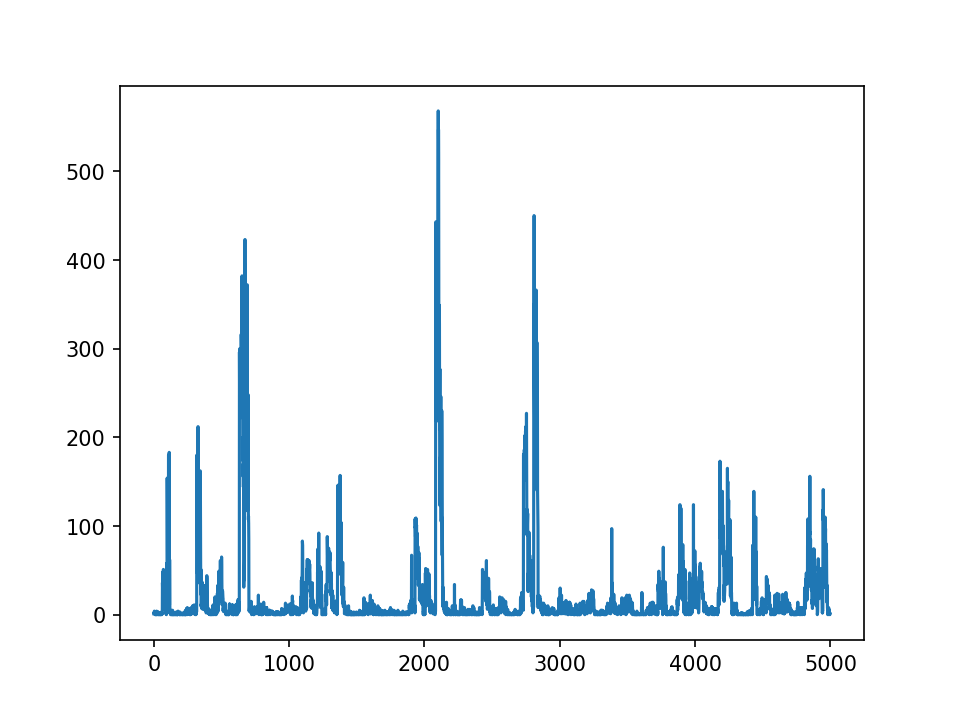

~~~C++
size_t h_crc32 (char* Key);
~~~
Возвращает реузльтат алгоритма CRC32
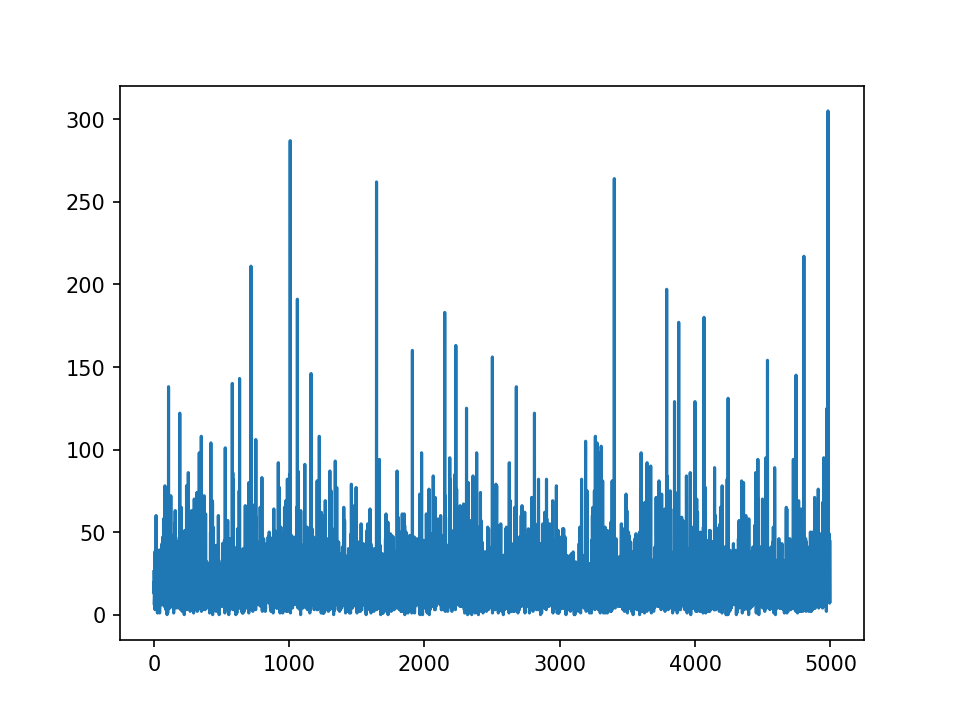


Из них была выбрана хэш-функция, ведущая себя наиболее равномерно. Таковй ожидаемо оказалась h_crc32.


## Оптимизация

Проанализируем данные, полученные профайлером. Основное время работы функции поиска *get_by_key* - сама хэш функция и *strcmp*. Начнем с оптимизации *strcmp*. Все измерения далее прифодятся на уровни оптимизации *-O0*

### Первая оптимизация

Для этого будем место строк хранить в таблице вектора  **__m256i**. Это можно сделать, так как все слова меньше 32 букв в длину.

Так как в течении работы я столкнулся с *неостановимым* желанием компилятора заменить *strcmp* на *__strcmp_avx2* (работает очень быстрои ее оптимизировать не выйдет), пришлось заменить ее функцией *my_strcmp*.
Новая функция сравнения строк выглядит так:

```C++
int my_strcmp (const char* str1, const char* str2)
{
    int i = 0;

    while ( (str1[i] == str2[i]) && (str1[i] != '\0') )
    {
        i++;
    }

    return (int) (str1[i] - str2[i]);
}
```
А векторов так:

```C++
inline const bool my_simd_cmp (const __m256i* FirstVector, const __m256i* SecondVector)
{
    return (_mm256_movemask_epi8(_mm256_cmpeq_epi64(*FirstVector, *SecondVector)) == (int) 0xFFFFFFFF);
}
```

Результаты первой оптимизации приведены ниже:

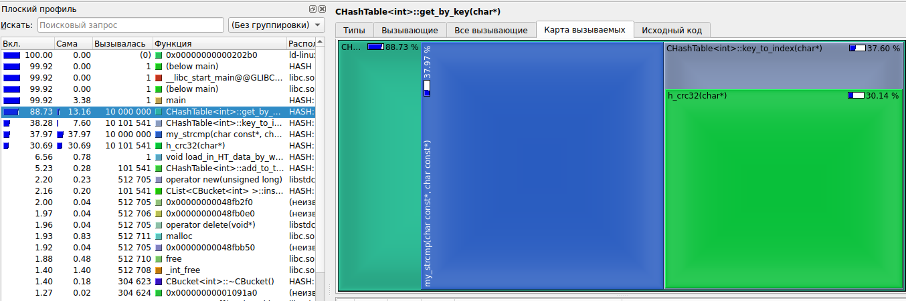
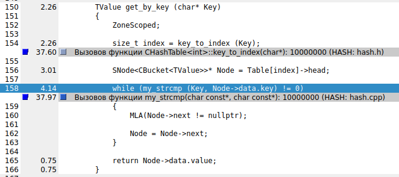

Старая реализация


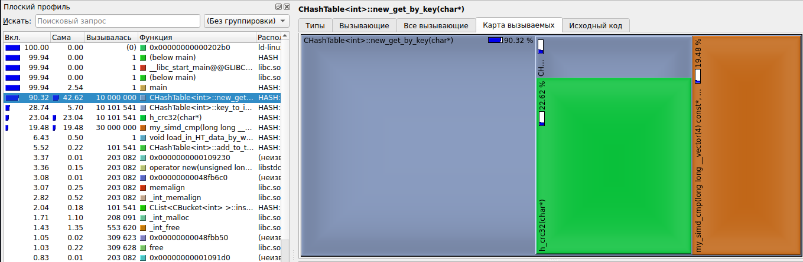
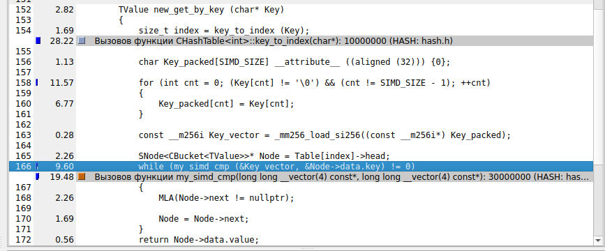

Новая реализация

Полезным результатом является уменьшение времени работы *strcmp*, но из-за необходимости векторизовать ключ, по которому ведется поиск, прирост в скорости работы отрицательный.

### Вторая оптимизация

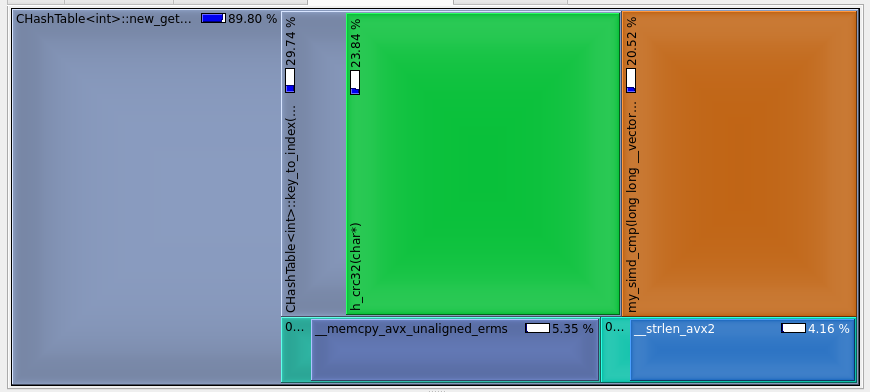
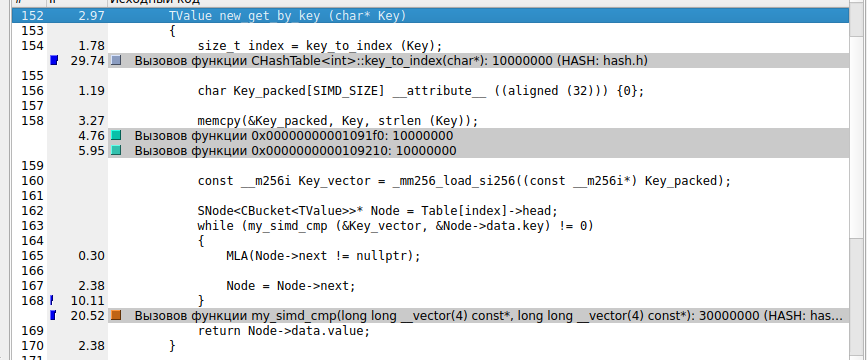

Векторизация строки будет быстрее, если воспользоваться функцией *memcpy*, но все еще мы не получим видмого преиущества. Слова в использвемой базе маленькие (4 - 5 букв), и обычная *strcmp* все еще эффективней.

### Третяя оптимизация

Раз оптимизировать функцию сравнения у нас не очень получается, попробуем оптимизировать хэш-функцию. CRC32 поддерживается аппаратно, поэтому воспользуемся ассемблерной вставкой.

```C++
size_t h_crc32 (char* Key)
{
    const uint8_t *buf = (const uint8_t *) Key;
    unsigned int crc = 0xffffffff;

    asm volatile
    (
        "crc32 %1, %0"
        : "=r"(crc)
        : "m"(*buf), "0"(crc)
    );

    return crc ^ 0xffffffff;
}
```

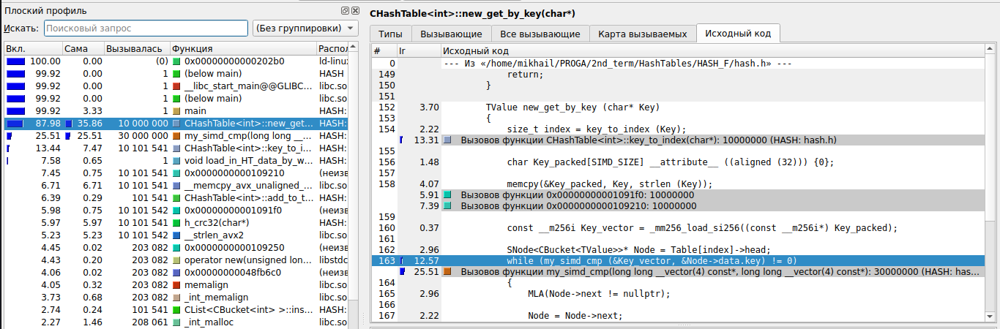
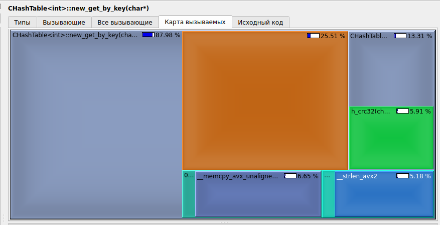

Итоговое время работы функции *get_by_key* теперь занимает 87.98% от общего времени выполнения программы вместо 88.8%. Таким образом удалось получить ускорение примерно в 1 процент.

## Итоги


| Оптимизации | Процент *get_by_key* | Улучшение | Глобальное улучшение |
|---|---|---|---|
| 0 | 88.73 | 0    | 0    |
| 1 | 90.32 | -1.5 | -1.5 |
| 2 | 89.80 | 0.7  | -1.2 |
| 3 | 87.98 | 1.9  |  0.9  |


Итог с одной стороны приятный - все, что можно опитимзировать, компилятор опитмизирует лучше человека. С другой стороны обидно, что много времени было потрачено без ощутимого результата. Единственное ускорение удалось получить с помощью использования аппаратной реализации хэш функции.

## Сборка

1. Клонируйте мой репозиторий, используя

```
git clone https://github.com/Mikhail038/MY_Hash_tables
```

2. Соберите проект
```
make
```
и запустите
```
./HASH
```

3. **ИЛИ** просто используйте
```
make graph
```
(Также выведет на экран график, построенный вспомогательным скриптом на Python)
