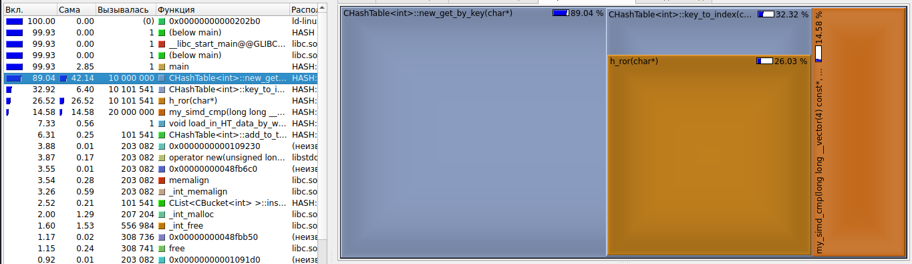
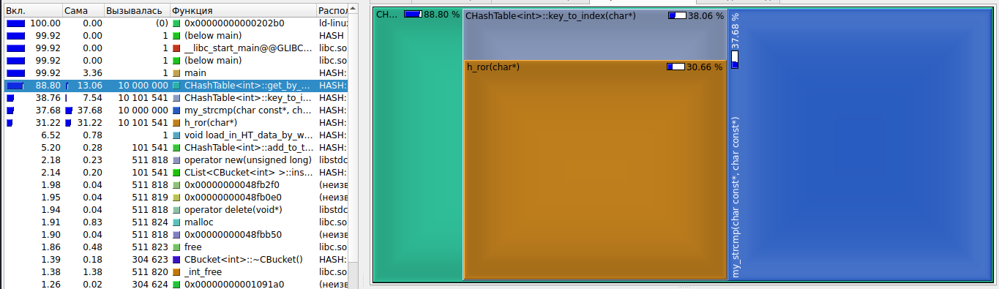

# Исследование и Оптимизация Хэш-Таблиц

**Михаил Р.** _04.2023._

## Сборка

1. Создайте пустой репозиторий с помощью

```
git init
```

2. Клонируйте мой репозиторий, используя

```
git clone https://github.com/Mikhail038/MY_Hash_tables
```

3. Соберите проект
```
make
```
и запустите
```
./HASH
```

4. **ИЛИ** просто используйте
```
make run
```
(Также выведет на экран график, построенный вспомогательным скриптом на Python)

## Предыстроия

Этот небольшой проект был написан мной прежде всего в целях обучения.

Основная идея - оптимизация вставки в Хэш-таблицу, используя знания Assembly и SIMD-Инструкций. Для эффективного исследования также был использован профайлер **callgrind** + **kcachgrind**.

## Оптимизация

Проанализируем данные, полученные профайлером. Основное время работы функции поиска *get_by_key* - сама хэш функция и *strcmp*. Начнем с оптимизации *strcmp*.

### Первая оптимизация

Для этого будем место строк хранить в таблице вектора  **__m256i**. Это можно сделать, так как все слова меньше 32 букв в длину.

Так как в течении работы я столкнулся с *неостановимым* желанием компилятора заменить *strcmp* на *__strcmp_avx2* (работает очень быстрои ее оптимизировать не выйдет), пришлось заменить ее функцией *my_strcmp*

Результаты первой оптимизации приведены ниже:





Полезным результатом является уменьшение времени работы *get_by_key* с 89.04 % до 88.80 % от общего времени работы.

### Вторая оптимизация

