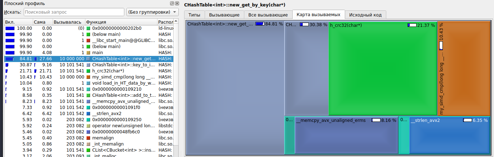
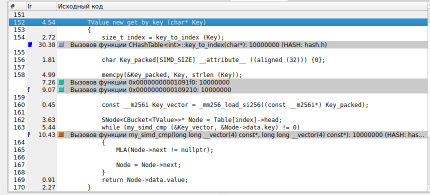

# Исследование и Оптимизация Хэш-Таблиц

**Михаил Р.** _04.2023._

## Сборка

1. Клонируйте мой репозиторий, используя

```
git clone https://github.com/Mikhail038/MY_Hash_tables
```

2. Соберите проект
```
make
```
и запустите
```
./HASH
```

3. **ИЛИ** просто используйте
```
make run
```
(Также выведет на экран график, построенный вспомогательным скриптом на Python)

## Предыстроия

Этот небольшой проект был написан мной прежде всего в целях обучения.

Основная идея - оптимизация вставки в Хэш-таблицу, используя знания Assembly и SIMD-Инструкций. Для эффективного исследования также был использован профайлер **callgrind** + **kcachegrind**.

## Оптимизация

Проанализируем данные, полученные профайлером. Основное время работы функции поиска *get_by_key* - сама хэш функция и *strcmp*. Начнем с оптимизации *strcmp*. Все измерения далее прифодятся на уровни оптимизации *-O0*

### Первая оптимизация

Для этого будем место строк хранить в таблице вектора  **__m256i**. Это можно сделать, так как все слова меньше 32 букв в длину.

Так как в течении работы я столкнулся с *неостановимым* желанием компилятора заменить *strcmp* на *__strcmp_avx2* (работает очень быстрои ее оптимизировать не выйдет), пришлось заменить ее функцией *my_strcmp*.
Новая функция сравнения строк выглядит так:

```
int my_strcmp (const char* str1, const char* str2)
{
    int i = 0;

    while ( (str1[i] == str2[i]) && (str1[i] != '\0') )
    {
        i++;
    }

    return (int) (str1[i] - str2[i]);
}
```
А векторов так:

```
inline const bool my_simd_cmp (const __m256i* FirstVector, const __m256i* SecondVector)
{
    return (_mm256_movemask_epi8(_mm256_cmpeq_epi64(*FirstVector, *SecondVector)) == (int) 0xFFFFFFFF);
}
```

Результаты первой оптимизации приведены ниже:


Старая реализация


Новая реализация

Полезным результатом является уменьшение времени работы *strcmp*, но из-за необходимости векторизовать ключ, по которому ведется поиск, прирост в скорости работы отрицательный.

### Вторая оптимизация


Векторизация строки будет быстрее, если воспользоваться функцией *memcpy*, но все еще мы не получим видмого преиущества. Слова в использвемой базе маленькие (4 - 5 букв), и обычная *strcmp* все еще эффективней.

### Третяя оптимизация

Раз оптимизировать функцию сравнения у нас не очень получается, попробуем оптимизировать хэш-функцию. CRC32 поддерживается аппаратно, поэтому воспользуемся ассемблерной вставкой.

```
asm volatile(
    ".intel_syntax noprefix\n"
    "crc32 %0, %1\n"
    ".att_syntax prefix\n"
    : "=r" (crc)
    : "r" (*buf), "r" (crc)
    :
);
```




Итоговое время работы функции *get_by_key* теперь занимает 84.8% от общего времени выполнения программы вместо 88.8%. Таким образом удалось получить ускорение в 4.5 процента.

## Итоги

Итог с одной стороны приятный - все, что можно опитимзировать, компилятор опитмизирует лучше человека. С другой стороны обидно, что много времени было потрачено без ощутимого результата. Единственное ускорение удалось получить с помощью использования аппаратной реализации хэш функции.
